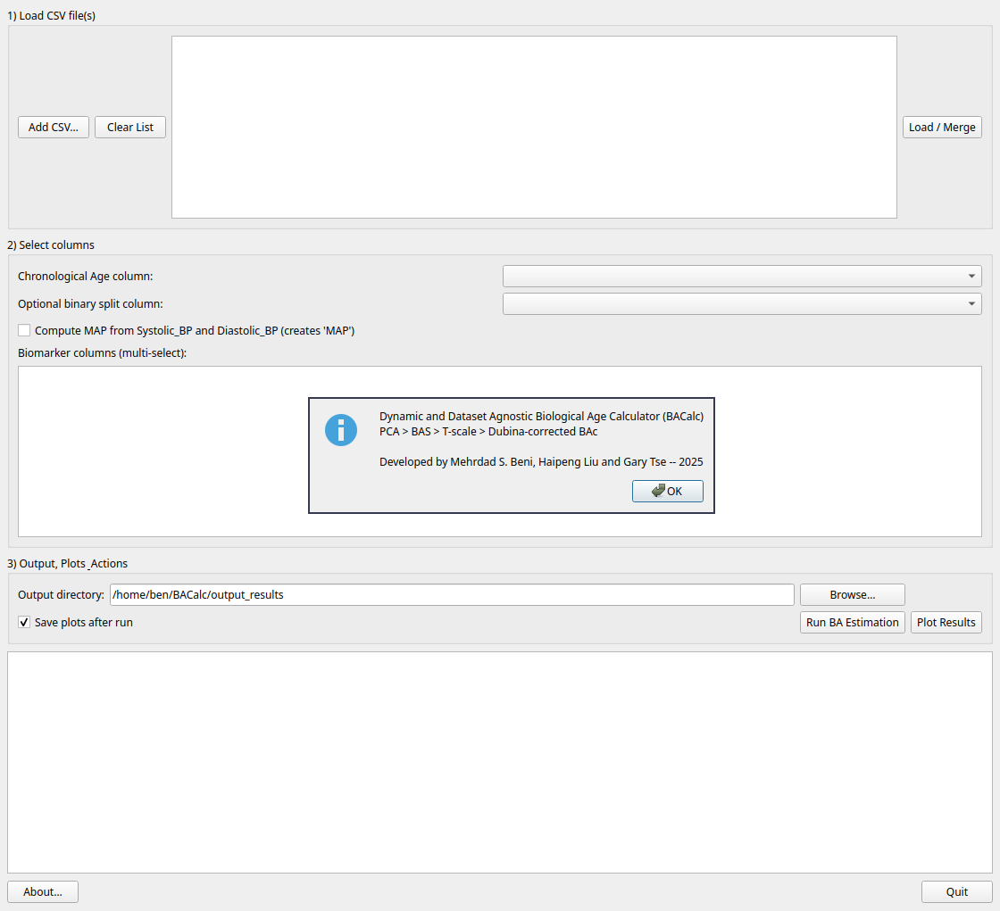

# BACalc (Qt Version)

BACalc Biological Age Program wirrten in Python Qt:
**PCA > BAS > T-scale > Dubina-corrected BAc and KDM Estimation**

## Screenshot


## Features
- Load/merge multiple CSVs
- Choose age column and an optional binary split column
- Select biomarker columns (multi-select, use CTRL+Click)
- Optional MAP computation from `Systolic_BP` and `Diastolic_BP`
- Runs two full pipeline:
  - Method 1: Runs PCA-Dubina.
  - Method 2: Runs KDM.
- Saves: `ba_predictions.csv`, `pca_loadings.csv`, `ba_coefficients.csv`, `ba_equations.txt`
- Generates global + per-group plots

## Quick start
```bash
# 1) Create venv (recommended)
python -m venv .venv && source .venv/bin/activate

# 2) Install dependencies
pip install -r requirements.txt

# 3) Run
python app.py
```

The BACalc writes outputs to the chosen "Output directory" (default: `./output_results`).

## Windows Exe Release
Users running Windows 64 operating system can download our exe builds for a simple and easy run.
